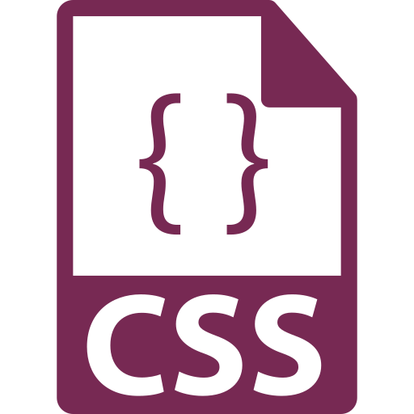

Web designers use all types of files to create sites, from `.html` to `.css` to `.php` and dozens of others. How files are created and saved will affect how they are processed; a `.css` file will not have the same capabilities of a `.html` file, and vice versa.

**Pages** are the most common inclusion in a web site, simply because pages contain the visible content of that site. Further files (such as images and other media) will most-likely be accessed from pages, through hyperlinks, embeds, and the like.

  

    
    page.html
  

  

    <h3>Hypertext Markup Language (<b>HTML</b> or <b>HTM</b>)</h3>
    
HTML is the standard language known by all web designers and developers. HTML provides the structure of the page, using <i>elements</i> to create headings, paragraphs, lists, tables, links, etc. Properly-laid-out HTML is designed to enhance accessibility, and provide structured content outside of decorative styling.

    <ul class="pros-and-cons">
      <li class="icon-pro">Easy-to-learn, free or low-cost.</li>
      <li class="icon-pro">Widely-used; standard practice.</li>
      <li class="icon-pro">Extensive; has a large library and support community.</li>
      <li class="icon-con">Requires a browser to correctly interpret the code.</li>
      <li class="icon-con">HTML Lexicon is in American English, and may require extra interpretation for non-English speakers.</li>
    </ul>
  

  

    
    page.css
  

  

    <h3>Cascading Style Sheet (<b>CSS</b>)</h3>
    
CSS is used to control how the page looks and functions. CSS is used to “decorate” the site; this is, provide layout, color, interactive elements, fonts, and other formatting. While HTML provides the contents of the page, CSS specifies to the browser how the site will look. Using a stylesheet greatly speeds up development time, as a single sheet can affect all pages in the site.

    <ul class="pros-and-cons">
      <li class="icon-pro">Speed and consistency in styling pages site-wide.</li>
      <li class="icon-pro">Supported by nearly all browsers.</li>
      <li class="icon-pro">Extensive; has a large library and support community.</li>
      <li class="icon-con">CSS syntax is different from HTML, and requires users to learn both languages.</li>
      <li class="icon-con">Interpreted differenly across browsers; requires testing.</li>
    </ul>
  

  

    
    page.php
  

  

    <h3>Hypertext Preprocessor (<b>PHP</b>)</h3>
    
While we won't get into PHP, you've likely seen or heard of PHP files. PHP is a widely-used, open-source scripting language which is well-suited for use in web design as it can be combined with HTML. A server-side language, PHP can generate dynamic pages, modify databases, encrypt data, and many other processes HTML cannot do alone. In fact, it is the core of many services, such as <a href="http://blog.teamtreehouse.com/php-for-wordpress-1" target="_blank">WordPress</a> and <A href="https://developers.facebook.com/docs/reference/php/" target="_blank">Facebook</a>.

    <ul class="pros-and-cons">
      <li class="icon-pro">Moderately easy-to-learn, free or low-cost.</li>
      <li class="icon-pro">Can collect data, like from site forms.</li>
      <li class="icon-pro">Can control user-access.</li>
      <li class="icon-con">Limited control.</li>
      <li class="icon-con">Can take time to master frameworks.</li>
    </ul>
  

Neat-O Most file types and their languages are designed to work _together,_ not singularly, and need to be directed to each other to function properly.
