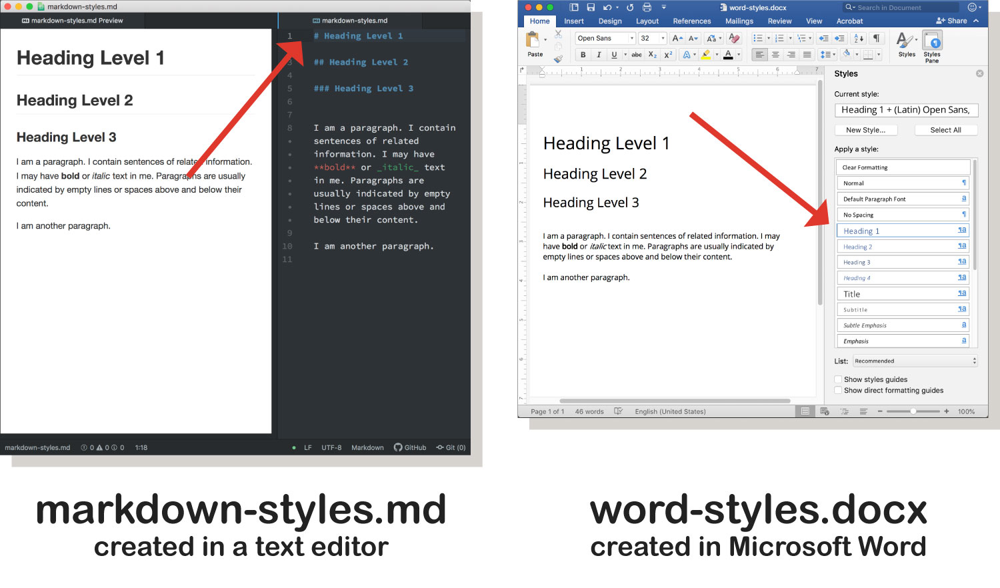

<div class="divider-heading"></div>


**HTML** or *HyperText Markup Language*, is one of the original markup languages and one you will be using extensively during this course. But to start, let's look at another slightly simpler and very popular markup language known as **Markdown.**

A Markdown file typically uses the `.md` extension.

For example, this page that you're reading right now is the file `markdown-files.md`.


## Markdown Usage
**Markdown files** encourage the writer to focus on *content and structure,* as opposed to formatting. In fact, this entire course has been developed for the web using Markdown files. In other words, at this very moment, you are reading a Markdown file.

This file type allows the writer to identify portions of the text as headers (at various levels), paragraphs, bold, italic, links, code, lists, and tables. It also allows the writer to easily include images through links in the document. Below is an example of Markdown.

<div class="code-heading">
  <span class="md">Markdown</span>
</div>
```markdown
# Intro to Markdown


**HTML** or *HyperText Markup Language*, is one of the original markup languages and one you will be using extensively during this course. But to start, let's look at another slightly simpler and very popular markup language known as **Markdown.**

A Markdown file typically uses the `.md` extension.

For example, this page that you're reading right now is the file `markdown-files.md`.
```

You can see that in other to make words **bold**, for example, I need to wrap them in double asterisks:  `**bold**`.


<div class="divider-pg"></div>


## What's the difference between Microsoft Word and Markdown files?
As mentioned previously, one of the main differences between a a Markdown (or more generally, “text document”) and a Microsoft Word file is that the former is stored as **text**, and the latter is stored as **binary code**. Microsoft does this for a number of reasons, one of these is to keep their product proprietary ($$). This binary file also allows for syntax and structure to be stored within the document file, without the user having to see it in the text itself.

In the image below, see how “style” is created in a text file (.md) versus using Word’s (.docx) “styles” selectors.


