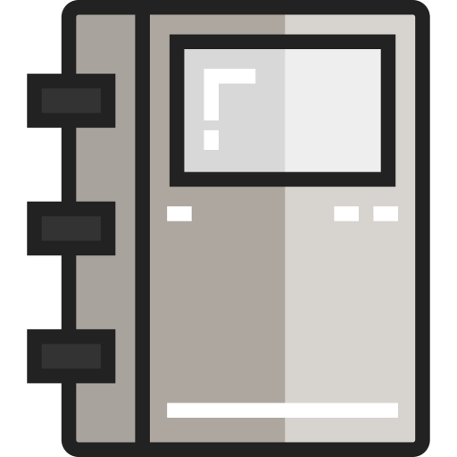

  
  <h2 style="text-align: center;">Files and Directories</h2>

Last week, we spent time with an overview of this course itself, the internet, the web, and what a web developer is. This week will build on these ideas by further expanding our development environment with more of the tools that you'll use throughout your time here.

By the end of this week, we hope you:
<ul class="pros-and-cons">
  <li class="icon-pro">Further understand the importance of well-organized and well-labeled files in web development.</li>
  <li class="icon-pro">Set up a new folder/directory locally, and experimented with how files communicate.</li>
  <li class="icon-pro">Coded with your first web language - Markdown!</li>
</ul>
