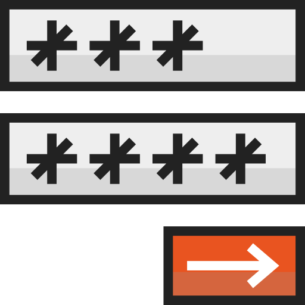

  
  <h2 style="text-align: center;">HTML Forms</h2>

This Topic, you'll be introduced to some multi-part elements, including tables and one of the foundations of web development - forms.

Although they appear antiquated by today's visual standards, HTML tables are still used quite often to present data in structured formats. One way to collect data from visitors is through forms, or question-response collections where users enter data that is then sent to a server for processing. A common form you encounter daily is the _user login_.

By the end of this Topic, we hope you:
<ul class="pros-and-cons">
  <li class="icon-pro">Understand how elements can be stringed together to better describe, present, and gather information</li>
  <li class="icon-pro">Played around with form elements, and explored how data is presented and collected on websites.</li>
</ul>
