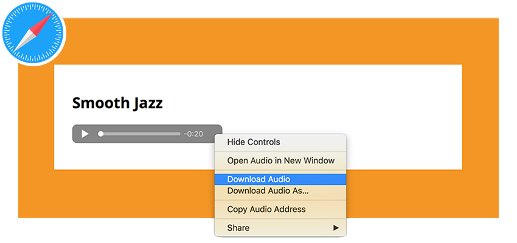
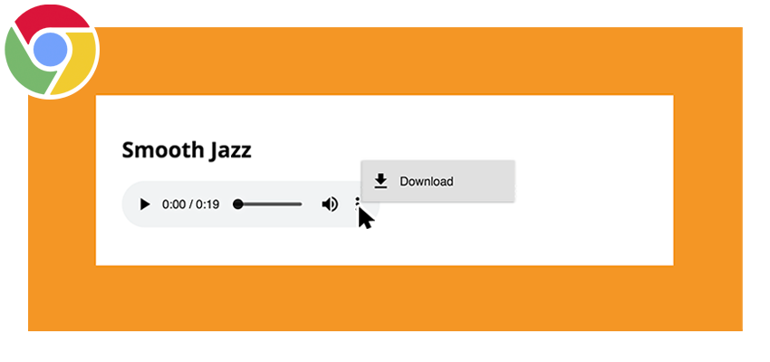

Important All media you use on your sites should be your own or in "fair public use," usually under [Creative Commons](https://creativecommons.org/) (CC) public licence. **You should always credit the author when asked to do so.**

Important Test your pages on multiple computers and browsers to make sure the embedded media works.

## Common Downloadable Audio Sources

- [The Audio Archive](https://archive.org/details/audio)
- [YouTube Audio Library](https://www.youtube.com/audiolibrary/music)
- [Freesound](https://freesound.org/)
- [Incompetech.com](https://incompetech.com/music/royalty-free/collections.php)

## How-To:

The Audio Archive, for example, is a great source of royalty-free and creative commons audio works, usually offered in MP3 format.
Here's an example from the [Apollo 11 landing](https://archive.org/details/SVS-3044) using Chrome:

  
<iframe src="https://archive.org/embed/SVS-3044" style="position:absolute;top:0;left:0;width:100%;height:100%;" frameborder="0" webkitallowfullscreen mozallowfullscreen allowfullscreen></iframe>

  

One of the potential issues of using the `<audio>` element in particular is that it allows end-users to easily download the audio file. For example, in Safari, this can be done by right-clicking the audio player and selecting “Download Audio.” Chrome actually provides a download button with the audio player.

This ability is something to weigh when considering _content protection_, discussed at the end of this section.
