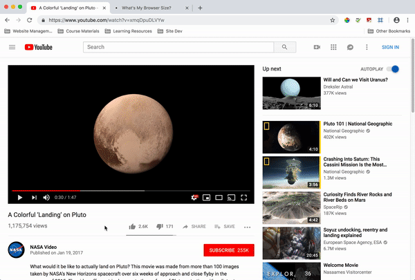

There are two ways to approach adding video to your site: self-hosted (within your own directory and repository), or via a video-sharing service, like [YouTube](https://www.youtube.com/) or [Vimeo](https://vimeo.com/).

## Self-Hosted Video

The `<video>` element allows developers to add a video player to webpages. This is a new element to HTML5, and offers three supported video formats: .mp4, .webm, and .ogg.

The **video element** can be used to add a self-hosted video file to your site, and allows for both single-instances and fallback files to be referenced in the element.

## Service-Hosted Video

To embed a video from a video-sharing service, use their provided embed code, which often utilizes the `<iframe>` element discussed previously in this Topic.

The following is an example for [YouTube](https://youtube.com):

