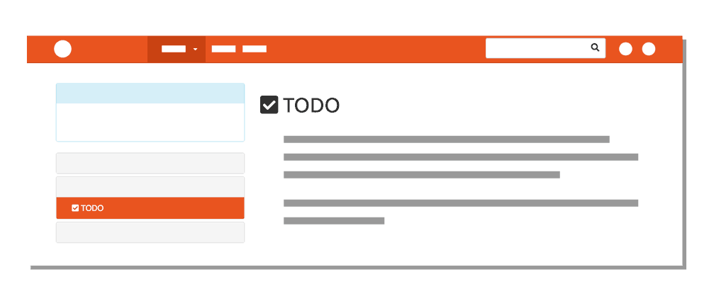

All sites utilize styling, whether its provided by the browser, or created by the designer. In this site, for example, pages contain different styling “commands” like:
- How to display links in a list.
- Change the background color of active links.
- Float icons to the left of text.
- Split window so page navigation is one-third (33%) of the width.
- What color to make all of the text.

For the most part, this is the same across all pages, but not always. I can control _page styling_ by selecting elements and applying styling properties (like color and placement) to them.

By now, you are familiar with two ways to **select** an “item” to style:
1. By the structural element itself:
    - `body {}` (“Do ___ to the entire body of the page.”)
    - `p {}` (“Do ___ to all paragraphs on the page.”)
2. By creating classes:
    - `.a-class {}` (“Do ___ to any element with `class="a-class"`.”)
    - `.another-class {}` (“Do ___ to any element with `class="another-class"`.”)

Let's explore this process by revisiting the **&lt;style&gt; element**, which allow you to add styling directly within the page you're working on.
