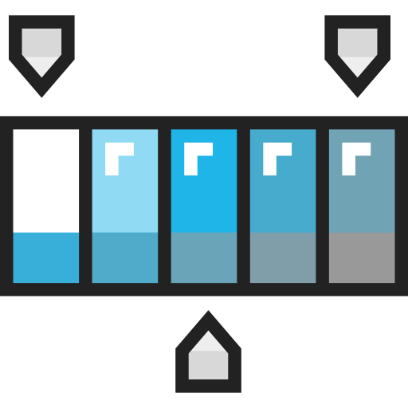

  
  <h2 style="text-align: center;">CSS Fundamentals</h2>

While we've explored styling briefly in the previous topics, it's time to really dig into learning how to use CSS or Cascading Style Sheets.

CSS is a language that tells browsers how to display and style content in HTML. It will not change the content itself, but will allow you to specify color, font, size, background, padding, alignment, how pages resize, if certain elements should be hidden, and many more qualities.

By the end of this Topic, we hope you:
<ul class="pros-and-cons">
  <li class="icon-pro">Understand how CSS functions in web design, and the many ways we can use it in our pages.</li>
  <li class="icon-pro">Have experimented with CSS selectors, and tried linking your _own_ stylesheet to your HTML pages.</li>
</ul>
