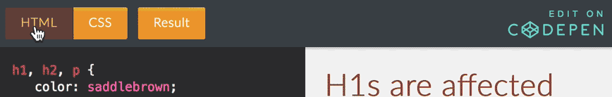

There are a lot properties that can be changed about an element. We will go over many, but not all of these. Luckily, many of the properties that you might want to change are intuitively labeled.

For example, the below example identified the "background color" for the
entire `body` element (usually the whole page) and set it to "orange."

## Altogether
NOTE: You can toggle between HTML and CSS frames in the CodePen embeds by simply clicking on their tabs:

  

