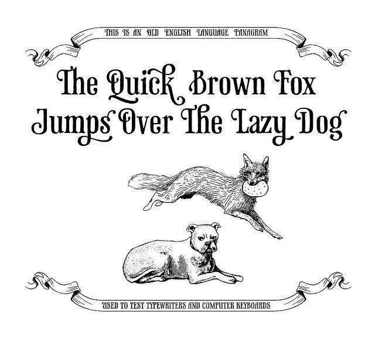

**Placeholders** are common in web design, particulalry in the early stages of a site build. You may have a client who wants an interactive portfolio, for example, but hasn't provided you with their own photos yet. You can begin creating the site using placeholders (or “fillers”, dummies, etc) with the intent to replace them when proper materials are attained.

You have probably heard of _lorem ipsum_ before, the most popular filler text:

  

    

      <ul class="bursts">
        <li class="deg0"></li>
        <li class="deg36"></li>
        <li class="deg72"></li>
        <li class="deg108"></li>
        <li class="deg144"></li>
        <li class="deg180"></li>
        <li class="deg216"></li>
        <li class="deg252"></li>
        <li class="deg288"></li>
        <li class="deg324"></li>
      </ul>
      <i class="fas fa-info-circle"></i>
    

  

  

    <h3>Lorem Ipsum</h3>
    
Lorem ipsum dolor sit amet, consectetur adipiscing elit, sed do eiusmod tempor incididunt ut labore et dolore magna aliqua. Ut enim ad minim veniam, quis nostrud exercitation ullamco laboris nisi ut aliquip ex ea commodo consequat.

  

As sites become more robost and tools more easily attained, we're starting to shy away from placeholders as they can easily become design crutches or are ill-reflective of client material. Something to keep in mind if front-end development is in your future.

## Text Generators

  

    

      

        <a href="https://loremipsum.io/" target="_blank" class="list-group-item">
          
          <h4 class="list-group-item-heading">Lorem Ipsum</h4>
          

          
<i class="fa fa-link" aria-hidden="true"></i> Site Link

        </a>
      

    

  

  

    

      

        <a href="https://www.blindtextgenerator.com/lorem-ipsum" target="_blank" class="list-group-item">
          
          <h4 class="list-group-item-heading">Cicero, Pangrams</h4>
          

          
<i class="fa fa-link" aria-hidden="true"></i> Site Link

        </a>
      

    

  

  

    

      

        <a href="http://www.elsewhere.org/pomo/" target="_blank" class="list-group-item">
          
          <h4 class="list-group-item-heading">Postmodernist Literature</h4>
          

          
<i class="fa fa-link" aria-hidden="true"></i> Site Link

        </a>
      

    

  

