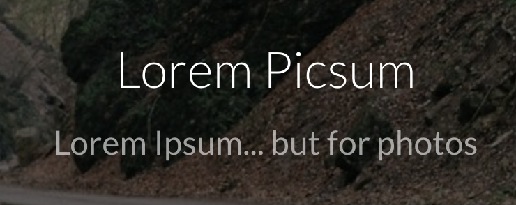

## Image Libraries (Stock Photos)
Certain image libraries are free-to-use (personally or commercially) and royalty-free, meaning you can not only use the image, you can use it multiple times and without attribution (citing its source).

Important Always check to make sure you have permission to use photos from a library. Terms (like if you need to add a link to your project) are stated when you attempt to download the file.

  

    

      

        <a href="https://www.pexels.com/" target="_blank" class="list-group-item">
          
          <h4 class="list-group-item-heading">Pexels</h4>
          

          
<i class="fa fa-link" aria-hidden="true"></i> Site Link

        </a>
      

    

  

  

    

      

        <a href="https://unsplash.com/" target="_blank" class="list-group-item">
          
          <h4 class="list-group-item-heading">Unsplash</h4>
          

          
<i class="fa fa-link" aria-hidden="true"></i> Site Link

        </a>
      

    

  

  

    

      

        <a href="https://pixabay.com/" target="_blank" class="list-group-item">
          
          <h4 class="list-group-item-heading">Pixabay</h4>
          

          
<i class="fa fa-link" aria-hidden="true"></i> Site Link

        </a>
      

    

  

## Randomizers and Generators
Some resources take the power to choose away, offering generated images on a click-by-click basis. While this is not ideal, these have their perks, often providing images at desired sizes or filters. Additionally, they may allow you to link to their photos through an iframe or hotlink, saving you hosting space.

  

    

      

        <a href="https://placeimg.com/" target="_blank" class="list-group-item">
          
          <h4 class="list-group-item-heading">PlaceIMG</h4>
          

          
<i class="fa fa-link" aria-hidden="true"></i> Site Link

        </a>
      

    

  

  

    

      

        <a href="https://picsum.photos/" target="_blank" class="list-group-item">
          
          <h4 class="list-group-item-heading">Lorem Picsum</h4>
          

          
<i class="fa fa-link" aria-hidden="true"></i> Site Link

        </a>
      

    

  

  

    

      

        <a href="http://dummy-image-generator.com/" target="_blank" class="list-group-item">
          
          <h4 class="list-group-item-heading">Dummy Image Generator</h4>
          

          
<i class="fa fa-link" aria-hidden="true"></i> Site Link

        </a>
      

    

  

## Generic Placeholder
Generic placeholders are uninspiring, but they can have their place in _early_ design stages. These offer simple shapes, set at and stating the dimensions of the future image file.

  

    

      

        <a href="https://dummyimage.com/" target="_blank" class="list-group-item">
          
          <h4 class="list-group-item-heading">Dynamic Dummy Image Generator</h4>
          

          
<i class="fa fa-link" aria-hidden="true"></i> Site Link

        </a>
      

    

  

  

    

      

        <a href="https://imgplaceholder.com/" target="_blank" class="list-group-item">
          
          <h4 class="list-group-item-heading">ImgPlaceholder</h4>
          

          
<i class="fa fa-link" aria-hidden="true"></i> Site Link

        </a>
      

    

  

  

    

      

        <a href="https://bendera.github.io/placeholder/" target="_blank" class="list-group-item">
          
          <h4 class="list-group-item-heading">Placeholder Image Generator</h4>
          

          
<i class="fa fa-link" aria-hidden="true"></i> Site Link

        </a>
      

    

  

