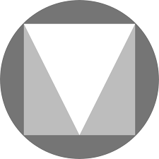

There are many free icon resources relating to needs like social media logos, filetypes, and graphics. Many resources required attribution, however, so be sure to confirm if and where it should be noted on your site.

  

    

      

        <a href="https://fontawesome.com/icons?d=gallery&m=free" target="_blank" class="list-group-item">
          <i class="icon-hw fab fa-font-awesome" aria-hidden="true"></i>
          <h4 class="list-group-item-heading">Font Awesome</h4>
          

          
<i class="fa fa-link" aria-hidden="true"></i> Site Link

        </a>
      

    

  

  

    

      

        <a href="https://material.io/tools/icons/?style=baseline" target="_blank" class="list-group-item">
          
          <h4 class="list-group-item-heading">Google Material Design Icons</h4>
          

          
<i class="fa fa-link" aria-hidden="true"></i> Site Link

        </a>
      

    

  

  

    

      

        <a href="https://www.flaticon.com/" target="_blank" class="list-group-item">
          
          <h4 class="list-group-item-heading">FlatIcon</h4>
          

          
<i class="fa fa-link" aria-hidden="true"></i> Site Link

        </a>
      

    

  

